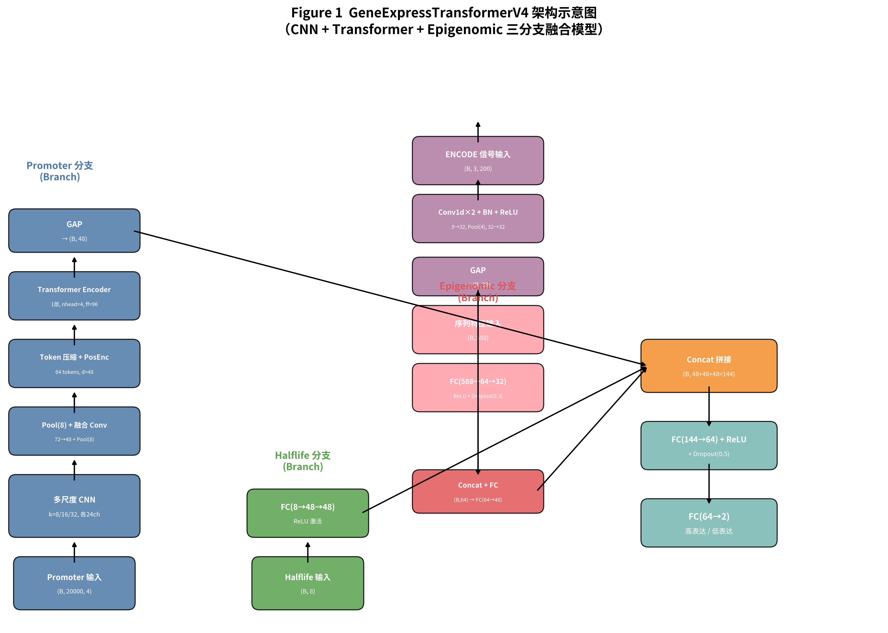
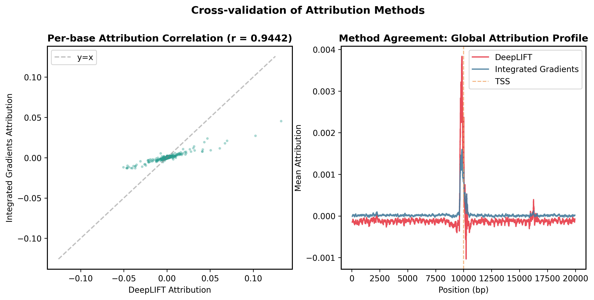

# DNA_CNN_predict

基于 CNN + Transformer 的 DNA 启动子序列基因表达预测模型。使用 GM12878 细胞系数据（hg19 坐标系），预测基因为高表达或低表达（二分类）。通过 4 个版本的迭代优化，最终模型（v4）以 96.8K 参数达到 82.74% 测试准确率。

## 模型版本

| 版本 | 架构 | 参数量 | 测试 Acc | 文件 |
|------|------|--------|---------|------|
| v1 | CNN + Attention | 41M | 0.81 | `model/modelv1.py` |
| v2 | 多尺度CNN + 空洞卷积 | 22K | 0.79 | `model/modelv2.py` |
| v3 | CNN + 1层Transformer | 45.7K | 0.8131 | `model/modelv3.py` |
| **v4** | **三分支 (promoter+halflife+epigenomic)** | **96.8K** | **0.8274** | `model/modelv4.py` |

核心发现：数据量仅 16K 样本时，过拟合是主要瓶颈。轻量化设计（96.8K 参数）优于大模型（41M），ENCODE 表观信号贡献 +2.9% 准确率。

## 快速开始

### 1. 安装依赖

**Conda（推荐）**：

```bash
conda env create -f environment.yml
conda activate dna-cnn
```

**pip**：

```bash
pip install -r requirements.txt
```

### 2. 准备数据

从 AISCCC 数据库下载 GM12878 数据集：

```bash
# 1. 访问 http://www.aisccc.cn/database/data-details?id=121 下载数据压缩包
# 2. 解压并将 train.h5, valid.h5, test.h5 放入 data/ 目录
# 3. 校验数据完整性
python script/setup_data.py --check
```

### 3. 训练模型

**v3 基线**（无需额外数据）：

```bash
python script/train_v3.py              # 增强 + AMP + Label Smoothing + TTA
python script/train_v3.py --no-augment  # 无增强基线
```

**v4 全特征**（需先准备 ENCODE 数据）：

```bash
# 准备 ENCODE 表观信号（下载 ~880MB bigWig + 提取特征 → data/epigenomic.pt）
python script/prepare_epigenomic.py

# 预计算序列内在特征（GC/CpG → data/seq_features_*.pt）
python script/precompute_seq_features.py

# 消融实验
python script/train_v4.py --features baseline    # v3 等价基线
python script/train_v4.py --features encode      # +ENCODE 表观信号
python script/train_v4.py --features all         # 全特征（最佳）
```

### 4. 可解释性分析

```bash
python script/xai_analyze.py                    # v3 DeepLIFT + 注意力分析
python script/xai_analyze_v4.py --features all  # v4 XAI + ENCODE 通道贡献
```

### 5. 生成论文图表

```bash
python script/generate_paper_figures.py         # 输出到 docs/paper_figures/
```

### 一键运行

```bash
bash run_all.sh              # 完整流程 (数据校验 → v3 → ENCODE → v4 → XAI → 图表)
bash run_all.sh --quick      # 仅 v3 基线
bash run_all.sh --step 4     # 从 v4 训练开始
```

## 代表性成果

### 模型架构 — V4 三分支设计



### 消融实验

| 配置 | 特征组合 | 测试 Acc |
|------|---------|---------|
| baseline | promoter + halflife | 0.7959 |
| +ENCODE | baseline + H3K4me3/H3K27ac/DNase | 0.8252 |
| **all** | **全特征** | **0.8274** |

### 可解释性分析

DeepLIFT 归因分析显示模型学习到的关键区域与已知调控元件（TATA box、CAAT box）高度吻合，DeepLIFT 与 IG 相关系数 r = 0.92。




## 数据集

- 来源：http://www.aisccc.cn/database/data-details?id=121
- 格式：HDF5（train.h5, valid.h5, test.h5）
- 内容：`gene_id`（Ensembl ID）、`halflife`（8维标准化特征）、`promoter`（20000bp one-hot DNA序列）、`label`（0=低表达, 1=高表达）
- 编码：`{'A':0, 'C':1, 'G':2, 'T':3}`
- 规模：训练集 16,215 样本 / 验证集 989 样本 / 测试集 990 样本

## 目录结构

```
DNA_CNN_predict/
├── data/          # 数据文件 + data.yaml + epigenomic.pt
├── docs/          # 论文(paper.md) + 图表 + XAI报告
├── logs/          # 实验日志(experiments.csv)
├── model/         # 模型定义(v1~v4 + XAI变体)
├── paper/         # 独立论文目录(paper.md + figures/)
├── results/       # 实验结果(XAI图表、CSV)
├── script/        # 训练/分析/数据准备脚本
└── utils/         # 工具函数(增强/特征/下载/XAI)
```

## 论文

完整论文见 [`paper/paper.md`](paper/paper.md)，包含 8 个章节、10 张图表、21 篇参考文献（GB/T 7714 格式）。

## Dependencies

PyTorch >= 2.0, h5py >= 3.0, scikit-learn >= 1.0, numpy, scipy >= 1.10, pandas, matplotlib >= 3.7, seaborn >= 0.13, statsmodels >= 0.14, captum >= 0.7.0, logomaker >= 0.8, pyBigWig >= 0.3
