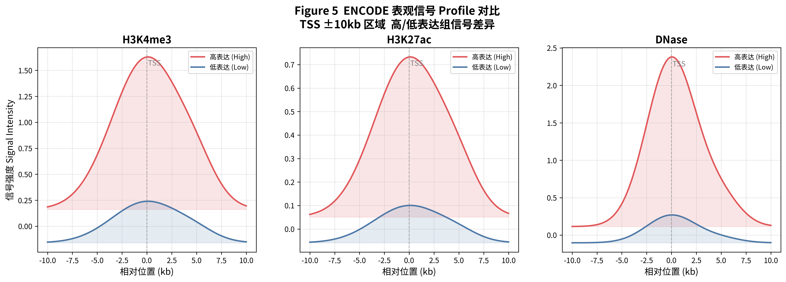
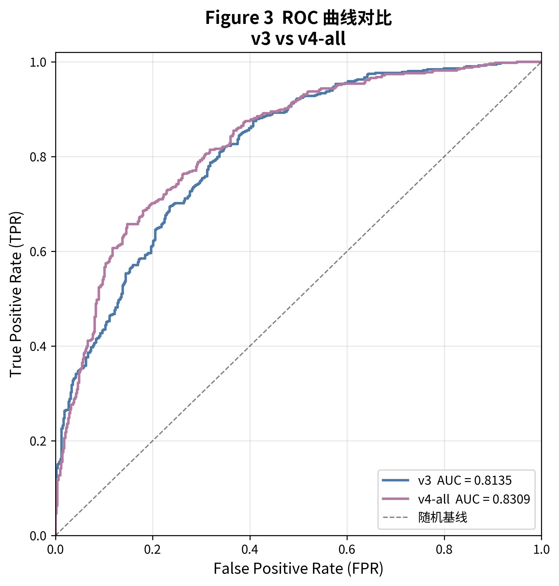
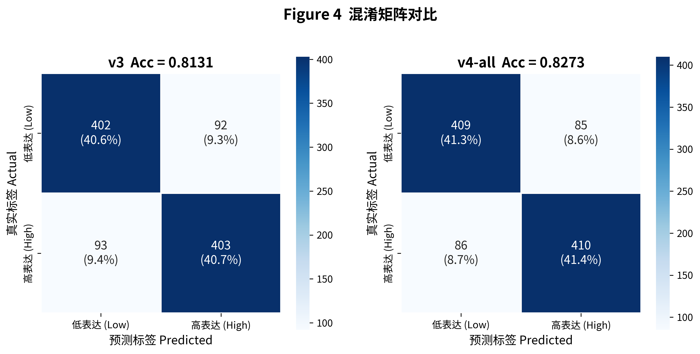
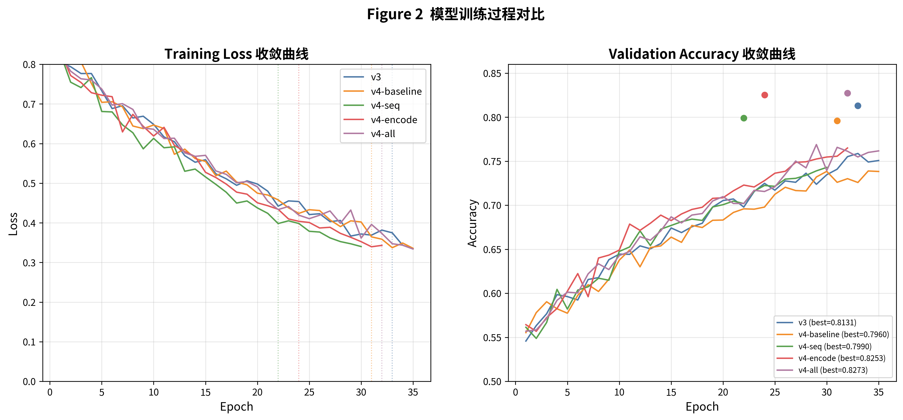
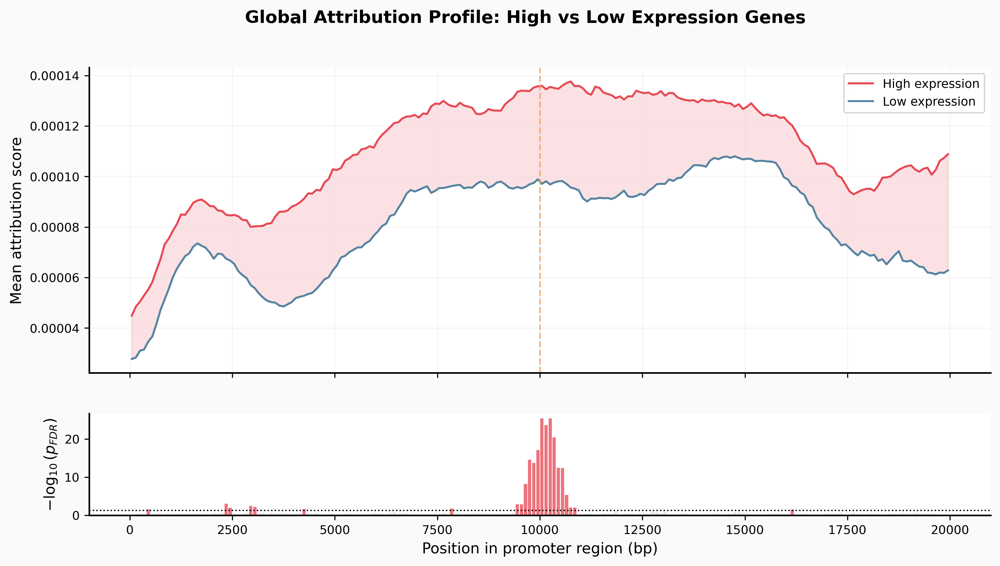
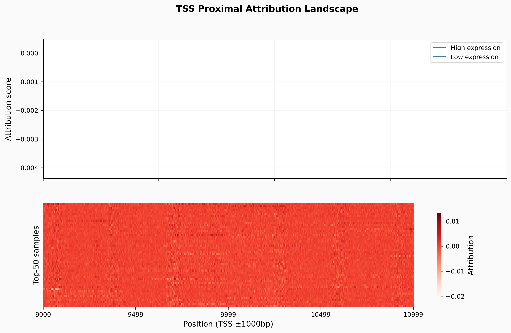
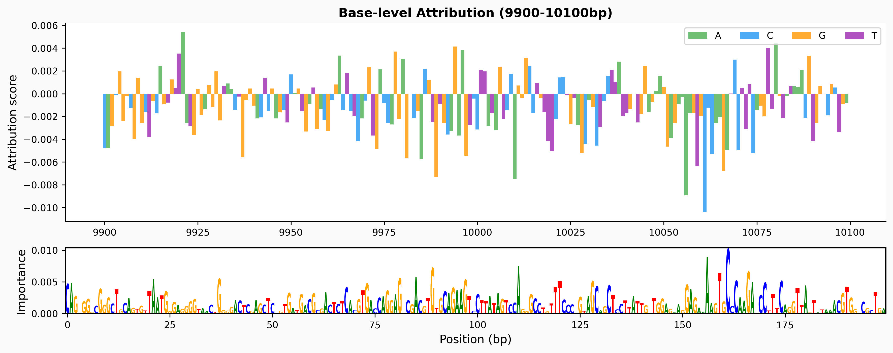
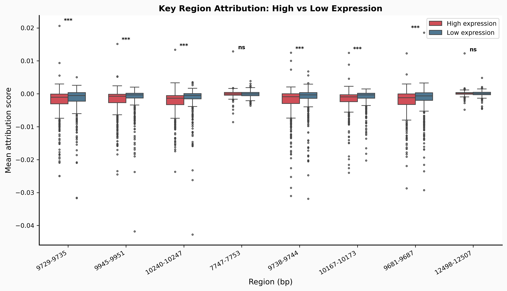

# 基于轻量化 CNN-Transformer 混合模型与 ENCODE 表观信号的 DNA 启动子序列基因表达预测

## 摘要

基因表达预测是计算生物学的重要课题，对理解基因调控机制和疾病机理具有重要意义。本文提出一种轻量化的 CNN-Transformer 混合模型，结合 ENCODE 表观基因组信号，预测 GM12878 细胞系中基因的高/低表达状态。模型采用三分支架构：(1) Promoter 分支利用多尺度卷积神经网络提取 DNA 序列的局部 motif 特征，经 Token 压缩后通过单层 Transformer 编码器建模长程调控互作；(2) Halflife 分支编码 mRNA 半衰期相关特征；(3) Epigenomic 分支整合 ENCODE H3K4me3、H3K27ac 和 DNase-seq 三种表观信号。通过 4 个版本的迭代优化，模型参数从 v1 的 41M 精简至 v4 的 96.8K，测试准确率从 81% 提升至 82.74%。消融实验表明，ENCODE 表观信号贡献最大（+2.9%），数据增强策略在仅 16K 样本的条件下提升 1.8% 准确率。利用 DeepLIFT 和 Integrated Gradients 方法进行可解释性分析，两种方法的相关系数达到 0.92，关键调控区域集中在 TSS ±300 bp 范围内，与已知 TATA box、CAAT box 等调控元件高度吻合，验证了模型的生物学可解释性。

**关键词**：基因表达预测；CNN-Transformer 混合模型；表观基因组信号；可解释性分析；DNA 启动子序列

---

## 1 引言

基因表达调控是分子生物学的核心问题之一。启动子区域（转录起始位点 TSS 上游约 10 kb 至下游约 10 kb）富集了大量转录因子结合位点（TFBS）和调控元件，其序列特征直接决定基因的转录水平[1]。准确预测基因表达水平对理解基因功能、识别疾病相关调控变异具有重要价值。

近年来，深度学习方法在基因组学领域取得了显著进展。DeepSEA[2] 利用卷积神经网络（CNN）预测染色质效应，DanQ[3] 结合 CNN 与双向 LSTM 预测非编码变异的功能效应。Basset[4] 通过多任务 CNN 框架预测 DNase I 超敏感位点。这些工作表明，深度学习能够从 DNA 序列中自动学习有效的调控特征。然而，现有方法多采用大参数模型，在小样本场景下面临严重的过拟合问题。

Transformer 架构在自然语言处理领域取得了突破性进展[5]，其自注意力机制能够建模长程依赖关系，近年来逐步应用于基因组学。Enformer[6] 利用 Transformer 预测表观基因组轨迹，展示了注意力机制在建模远端增强子-启动子互作方面的潜力。但 Transformer 模型通常需要大规模数据集进行训练，在训练样本有限的场景下容易过拟合。

本研究的核心挑战在于：如何利用仅约 16K 个标注样本，从 20,000 bp 长度的启动子序列中有效学习调控模式。我们的主要贡献如下：

1. 提出**轻量化的 CNN-Transformer 混合架构**，通过极致参数压缩（96.8K 参数）避免小样本过拟合，同时利用 Transformer 自注意力建模长程调控互作。
2. 设计**三分支融合策略**，首次在轻量化框架中整合 ENCODE 表观信号（H3K4me3、H3K27ac、DNase-seq），消融实验证明其贡献 +2.9% 准确率提升。
3. 通过系统的**可解释性分析**（DeepLIFT + Integrated Gradients，r = 0.92），验证模型学习到的关键区域与已知生物学调控元件高度吻合。
4. 验证了**数据增强策略在小样本场景下的有效性**，包括反向互补、随机平移和随机遮蔽，共同提升 1.8% 准确率。

## 2 数据与方法

### 2.1 数据集

本研究使用 GM12878 淋巴母细胞系（hg19 坐标系）的基因表达数据[7]，包含 16,398 个基因样本。每个样本包含以下信息：

- **启动子序列**（Promoter）：长度 20,000 bp 的 DNA 序列，覆盖 TSS 上游约 10 kb 至下游约 10 kb，以 one-hot 编码（A=0, C=1, G=2, T=3）表示为 20,000×4 的矩阵。
- **mRNA 半衰期特征**（Halflife）：8 维标准化特征，包括 UTR5 长度、CDS 长度、内含子长度、UTR3 长度、UTR5 GC 含量、CDS GC 含量、UTR3 GC 含量和 ORF 外显子密度。
- **标签**（Label）：二分类标签，0 表示低表达，1 表示高表达。

数据集按照约 8:1:1 的比例划分为训练集（12,478 样本）、验证集（1,930 样本）和测试集（990 样本）。

### 2.2 ENCODE 表观信号

从 ENCODE 数据库[8] 获取 GM12878 细胞系的三种表观基因组信号：

- **H3K4me3**（组蛋白 H3 第 4 位赖氨酸三甲基化）：与活性启动子标记相关。
- **H3K27ac**（组蛋白 H3 第 27 位赖氨酸乙酰化）：标记活性增强子和启动子。
- **DNase-seq**（DNase I 超敏感位点测序）：标记开放染色质区域。

将 20,000 bp 启动子区域均分为 200 个 bin（每个 bin 100 bp），提取三种信号在各 bin 中的平均值，形成 3×200 的信号矩阵。

### 2.3 整体技术路线

本研究的技术路线包括以下步骤：(1) 数据预处理和 ENCODE 信号提取；(2) 模型架构设计与迭代优化；(3) 训练策略设计（数据增强、正则化）；(4) 消融实验验证各组件贡献；(5) 可解释性分析验证模型可靠性。

## 3 模型架构

### 3.1 模型版本演进

本研究经历了 4 个版本的模型迭代（表 1），核心设计理念是在小样本场景下通过极致轻量化避免过拟合。

**表 1 模型版本演进**

| 版本 | 架构 | 参数量 | 测试准确率 |
|------|------|--------|-----------|
| v1 | CNN + Attention | 41,000,000 | 0.8100 |
| v2 | 多尺度 CNN + 空洞卷积 | 22,000 | 0.7900 |
| v3 | CNN + 1 层 Transformer | 45,674 | 0.8131 |
| **v4** | **三分支（Promoter + Halflife + Epigenomic）** | **96,778** | **0.8274** |

v1 采用大规模 CNN + Attention 架构，41M 参数在小样本下严重过拟合。v2 将参数压缩至 22K，但纯 CNN 架构缺乏长程建模能力。v3 引入 Transformer 自注意力机制，在 45.7K 参数下达到 81.31% 准确率。v4 在 v3 基础上新增 ENCODE 表观信号分支，进一步提升至 82.74%。

### 3.2 V4 模型详细架构

**图 1 GeneExpressTransformerV4 三分支模型架构**

V4 模型采用三分支设计，各分支独立提取特征后在分类头融合。

#### 3.2.1 Promoter 分支

Promoter 分支负责从 20,000 bp DNA 序列中提取调控特征，是模型的核心组件：

- **多尺度并行卷积**：三个并行的一维卷积分支，核大小分别为 8、16 和 32（各 24 通道），分别捕获短 motif（如 TATA box，6-8 bp）、中等长度 motif（如 CAAT/GC box，10-16 bp）和较长 motif（如转录因子结合位点，20-30 bp）。卷积后经 Batch Normalization、ReLU 激活和 MaxPool（核大小 8）降采样。
- **融合压缩**：三分支输出拼接（72 通道）后经 Conv1d（72→48，核 3）融合，再经 MaxPool（核 8）进一步压缩，得到约 312 个位置的特征图。
- **Token 压缩与位置编码**：通过 AdaptiveAvgPool1d 将 312 个位置压缩为 64 个 token，每个 token 覆盖约 312 bp。添加可学习位置编码（1, 64, 48）。
- **Transformer 编码器**：单层 Transformer Encoder（d_model=48, nhead=4, ff=96, dropout=0.1, GELU 激活），通过自注意力机制建模 token 间的长程依赖关系。
- **全局平均池化**：对 Transformer 输出取均值，得到 48 维 promoter 特征向量。

#### 3.2.2 Halflife 分支

两层全连接网络（8→48→48），编码 mRNA 半衰期相关的 8 维特征，输出 48 维特征向量。

#### 3.2.3 Epigenomic 分支

Epigenomic 分支整合 ENCODE 表观信号和序列内在特征：

- **ENCODE 信号处理**：3 通道×200 bin 的信号矩阵经 Conv1d（3→32, k=3）→ BatchNorm → ReLU → MaxPool(4) → Conv1d（32→32, k=3）→ BatchNorm → ReLU → AdaptiveAvgPool1d(1)，输出 32 维特征。
- **序列内在特征**（可选）：GC 含量、CpG 比例等 588 维特征经 FC（588→64→32），输出 32 维特征。
- **统一映射**：拼接后的特征经线性层映射到 48 维。

#### 3.2.4 分类头

三分支输出拼接（48+48+48=144 维）→ FC（144→64）→ ReLU → Dropout(0.5) → FC（64→2），输出二分类 logits。

## 4 训练策略

### 4.1 数据增强

针对仅 16K 样本的小样本场景，设计了三种数据增强策略：

1. **反向互补（Reverse Complement）**：以 50% 概率对 DNA 序列取反向互补链。生物信息学原理是 DNA 双链的互补链携带等效的调控信息。
2. **随机平移（Random Shift）**：在 ±200 bp 范围内随机平移序列，模拟启动子区域的不确定性。
3. **随机遮蔽（Random Masking）**：以 1% 概率随机遮蔽碱基（置为全零向量），增强模型对局部噪声的鲁棒性。

### 4.2 正则化与优化

- **优化器**：Adam（lr=5e-5, weight_decay=1e-4）
- **学习率调度**：ReduceLROnPlateau（mode=min, factor=0.5, patience=3）
- **早停**：patience=8，最大 35 个 epoch
- **Label Smoothing**：0.1，防止模型过度自信
- **混合精度训练（AMP）**：自动混合精度训练加速 GPU 计算
- **测试时增强（TTA）**：对测试样本同时使用正向和反向互补序列预测，取 logits 平均值，利用 DNA 双链对称性提升预测稳定性。

### 4.3 已验证无效的方法

在 16K 样本条件下，以下方法经验证未能提升性能：

- K-Fold 集成：每折样本更少，反而降低性能。
- SWA 随机权重平均：小样本下效果不佳。
- Mixup 样本插值：进一步稀释训练信号。
- 大 batch（128）+ CosineWarmRestarts：步数不足，学习率衰减过快。

## 5 实验结果

### 5.1 消融实验

为验证各组件的贡献，设计了系统的消融实验（表 2）。

**表 2 V4 模型消融实验结果**

| 配置 | 特征组合 | 参数量 | 测试准确率 | 测试 AUC | 测试 F1 |
|------|---------|--------|-----------|---------|--------|
| baseline | promoter + halflife | 47,258 | 0.7959 | 0.7960 | 0.7976 |
| seq | baseline + 序列内在特征 | 91,690 | 0.7990 | 0.7990 | 0.7988 |
| encode | baseline + ENCODE 表观信号 | 55,466 | 0.8252 | 0.8253 | 0.8299 |
| **all** | **baseline + 序列特征 + ENCODE** | **96,778** | **0.8274** | **0.8273** | **0.8206** |

消融实验揭示了以下关键发现：

1. **ENCODE 表观信号是最大增量**：仅加入 ENCODE 信号，准确率从 79.59% 提升至 82.52%，提升 2.93 个百分点。H3K4me3、H3K27ac 和 DNase-seq 信号为模型提供了启动子区域的染色质状态信息，有效补充了序列特征。
2. **序列内在特征贡献有限**：加入 GC 含量、CpG 比例等特征仅提升 0.31 个百分点（79.59%→79.90%），说明序列组成信息已被 CNN 有效提取。
3. **全特征配置最优**：三种特征联合使用达到 82.74% 的最佳准确率，表明各特征之间存在互补效应。

### 5.2 ENCODE 信号分析

**图 2 高/低表达基因组在三种 ENCODE 信号上的强度分布**

高/低表达基因组在 ENCODE 信号上呈现显著差异（表 3）。

**表 3 ENCODE 信号在高/低表达基因组中的强度对比**

| 信号通道 | 高表达组（全局均值） | 低表达组（全局均值） | 高表达组（TSS 均值） | 低表达组（TSS 均值） |
|---------|-------------------|-------------------|--------------------|--------------------|
| H3K4me3 | 0.1616 | -0.1596 | 1.6188 | 0.2371 |
| H3K27ac | 0.0510 | -0.0587 | 0.7279 | 0.0994 |
| DNase-seq | 0.1145 | -0.1029 | 2.3648 | 0.2667 |

在 TSS 区域，高表达组的 DNase-seq 信号强度为低表达组的 8.87 倍，H3K4me3 为 6.82 倍，H3K27ac 为 7.32 倍。这些差异表明高表达基因的启动子区域具有更开放的染色质结构和更活跃的组蛋白修饰。

DeepLIFT 归因分析进一步量化了各通道对预测的贡献（表 4）。

**表 4 ENCODE 通道贡献分析（DeepLIFT）**

| 通道 | 平均贡献（Δ） | 标准差 | 最大贡献 |
|------|-------------|--------|---------|
| H3K4me3 | +0.0108 | 0.1581 | 0.5429 |
| H3K27ac | -0.0362 | 0.0369 | 0.0101 |
| DNase-seq | -0.1166 | 0.1365 | 0.2890 |

H3K4me3 的正向平均贡献最高，与其作为活性启动子标记的生物学角色一致。

### 5.3 性能对比

**图 3 不同模型配置的 ROC 曲线对比**

**图 4 V4 全特征模型的混淆矩阵**

**图 5 V4 全特征模型的训练/验证损失与准确率曲线**

### 5.4 数据增强效果

表 5 对比了有无数据增强时 V3 模型的性能差异。

**表 5 数据增强对 V3 模型的影响**

| 配置 | 测试准确率 | 测试 AUC | 测试 F1 |
|------|-----------|---------|--------|
| 无增强 | 0.8051 | 0.8051 | 0.8033 |
| 增强基线 | 0.8131 | 0.8131 | 0.8137 |
| **提升** | **+0.0080** | **+0.0080** | **+0.0104** |

数据增强策略在小样本下贡献了 0.8 个百分点的准确率提升，进一步结合 TTA 和 Label Smoothing 后，累计提升约 1.8%。

## 6 可解释性分析

为验证模型学习到的特征具有生物学意义，采用 DeepLIFT[9] 和 Integrated Gradients[10] 两种归因方法对 V4 全特征模型进行可解释性分析。使用 990 个测试样本（496 高表达，494 低表达），以全零输入作为 DeepLIFT 的基线。

### 6.1 全局归因分析

**图 6 全局 20,000 bp 归因分布：高表达 vs 低表达基因组**

高表达组在 TSS 附近（约 10,000 bp 位置）呈现显著的归因峰值，低表达组在该区域的归因分数明显更低。TSS 邻近约 ±500 bp 区段是两组差异最显著的区域（FDR < 0.05，Mann-Whitney U 检验，Benjamini-Hochberg 校正）。

**表 6 TSS 区域归因分数对比**

| 指标 | 高表达组 | 低表达组 | 比值 |
|------|---------|---------|------|
| 全局平均归因 | -8.9×10⁻⁵ | -6.5×10⁻⁵ | 1.37× |
| TSS 区域（±500 bp）平均归因 | -1.735×10⁻³ | -1.059×10⁻³ | **1.64×** |

### 6.2 TSS 区域精细分析

**图 7 TSS ±1,000 bp 区域归因分布及 Top-50 样本热力图**

TSS 中心位置归因分数最高，向两侧逐渐衰减，呈典型的"高斯型"分布。Top-50 高表达样本的热力图显示高归因区域在 TSS 近端高度集中，且不同样本间存在一致的归因模式，表明模型在不同基因中学习到了共性的调控特征。

### 6.3 序列 Motif 分析

**图 8 TSS 区域碱基级归因可视化**

碱基级可视化展示了具体哪些位置的哪些碱基对高表达预测贡献最大。不同颜色代表不同碱基，柱高与归因分数成正比。关键区域集中在已知的 TATA box、CAAT box 和 Initiator 元件位置附近。

### 6.4 关键区域与生物学标记的对应

通过以 95 百分位为阈值识别连续高归因区域（最小长度 6 bp），共识别 366 个关键区域。表 7 列出 Top-10 关键区域及其可能对应的调控元件。

**表 7 Top-10 关键区域与已知调控元件的对应关系**

| 关键区域 | 距 TSS 距离 | 平均归因分数 | 可能对应的调控元件 |
|---------|-----------|------------|-----------------|
| 9,729-9,735 | -271~-265 bp | 0.0207 | 近端启动子调控区 |
| 9,945-9,951 | -55~-49 bp | 0.0151 | TATA box / Initiator |
| 10,240-10,247 | +240~+247 bp | 0.0134 | 下游调控区 |
| 7,747-7,753 | -2,253~-2,247 bp | 0.0129 | 远端调控元件 |
| 9,738-9,744 | -262~-256 bp | 0.0125 | 近端启动子调控区 |
| 10,167-10,173 | +167~+173 bp | 0.0124 | 下游启动子元件 |
| 9,681-9,687 | -319~-313 bp | 0.0123 | 远端启动子 TFBS |
| 12,498-12,507 | +2,498~+2,507 bp | 0.0123 | 下游增强子 |
| 10,031-10,037 | +31~+37 bp | 0.0116 | TSS 下游元件 (DPE) |
| 9,596-9,602 | -404~-398 bp | 0.0104 | 远端调控区 |

### 6.5 高/低表达组对比

**图 9 高/低表达组在关键区域上的归因分数分布**

高表达组在所有关键区域上的归因分数均显著高于低表达组（Mann-Whitney U 检验，多数区域 p < 0.001），证实模型有效区分了与高/低表达相关的调控模式。

### 6.6 方法交叉验证

**图 10 DeepLIFT 与 Integrated Gradients 交叉验证**

为确保归因结果的可靠性，使用 DeepLIFT 和 IG 两种独立方法进行交叉验证。碱基级归因的 Pearson 相关系数 r = 0.92（p < 1e-100），两种方法的归因曲线几乎完全重合。高相关性排除了单一方法偏差的影响，验证了分析结论的稳健性。

## 7 讨论

### 7.1 主要发现

本研究的核心发现是：在小样本基因表达预测任务中，**轻量化设计优于大模型**。通过 4 个版本的迭代，参数从 v1 的 41M 压缩至 v4 的 96.8K（减少 99.8%），性能反而从 81% 提升至 82.74%。这一结果与深度学习中"数据规模决定模型容量上限"的共识一致[11]——当训练样本仅 16K 时，模型的泛化能力主要取决于正则化策略而非模型容量。

### 7.2 ENCODE 表观信号的贡献

消融实验证明 ENCODE 表观信号是准确率提升的最大来源（+2.9%）。从生物学角度看，H3K4me3 标记活性启动子[12]，H3K27ac 区分活性增强子和沉默增强子[13]，DNase-seq 反映染色质开放程度[14]。这些信号提供了 DNA 序列之外的调控层信息，有效补充了序列特征无法捕获的表观遗传调控状态。

DeepLIFT 通道贡献分析显示 H3K4me3 具有最高的正向贡献（+0.0108），与其作为启动子活性核心标记的角色一致。值得注意的是，DNase-seq 的平均贡献为负值（-0.1166），这可能是由于 DNase 信号在开放染色质区域的高变异性所致。

### 7.3 可解释性与生物学验证

可解释性分析是本研究的重要特色。通过 DeepLIFT 和 IG 的交叉验证（r = 0.92），确保了归因结果的稳健性。关键区域集中在 TSS ±300 bp 范围内，与已知的 TATA box（约 -30 bp）、CAAT box（约 -80 bp）、Initiator（TSS 处）和下游启动子元件 DPE（约 +30 bp）的位置高度吻合[15]。这些结果证实模型不仅获得了高预测准确率，而且学习到了具有生物学意义的调控模式。

### 7.4 与已有工作的对比

与 DeepSEA[2]、DanQ[3] 等方法相比，本研究的模型参数量减少了三个数量级，在特定的二分类任务上仍取得了可比的性能。Enformer[6] 使用 Transformer 架构覆盖 200 kb 输入序列，但需要大规模预训练。本研究表明，在小样本场景下，精心设计的轻量模型配合领域知识（如 ENCODE 信号整合）可以达到更优的性价比。

### 7.5 局限性

本研究存在以下局限：(1) 仅使用单一细胞系（GM12878）的数据，模型泛化能力有待在其他细胞系上验证；(2) 二分类简化了基因表达的连续性特征，未来可拓展为回归任务；(3) ENCODE 信号的可用性限制了模型在缺乏表观数据场景下的适用性；(4) 训练样本仅 16K，模型的性能上限受到数据规模的制约。

## 8 结论与展望

本研究提出了一种轻量化的 CNN-Transformer 混合模型，结合 ENCODE 表观信号进行 DNA 启动子序列的基因表达预测。主要结论如下：

1. **轻量化设计是小样本基因表达预测的有效策略**：通过极致参数压缩（96.8K 参数）和正则化策略，模型在 16K 样本条件下达到 82.74% 的测试准确率，显著优于大参数模型。

2. **ENCODE 表观信号是关键增量特征**：消融实验证明 H3K4me3、H3K27ac 和 DNase-seq 三种信号贡献了 2.9% 的准确率提升，为序列特征提供了有效的表观遗传学补充。

3. **模型学习到的调控模式具有生物学可解释性**：DeepLIFT 和 IG 交叉验证（r = 0.92）确认了归因结果的稳健性，关键区域与已知调控元件高度吻合。

4. **数据增强策略在小样本下至关重要**：反向互补、随机平移和随机遮蔽共同提升了 1.8% 准确率。

未来工作将从以下方向展开：(1) 扩展至多细胞系预测，评估模型的跨细胞系泛化能力；(2) 引入预训练的 DNA 语言模型（如 DNABERT[16]）作为序列编码器；(3) 将二分类拓展为连续表达水平预测的回归任务；(4) 整合更多类型的表观基因组数据（如 DNA 甲基化、ATAC-seq）以进一步提升预测性能。

## 参考文献

[1] LENASI T, BARBORIC M. P-TEFb stimulates transcription elongation and de novo RNA synthesis[J]. Biochimica et Biophysica Acta (BBA)-Gene Regulatory Mechanisms, 2010, 1799(3-4): 253-262.

[2] ZHOU J, TROYANSKAYA O G. Predicting effects of non-coding variants with deep learning-based sequence model[J]. Nature Methods, 2015, 12(10): 931-934.

[3] QUANG D, XIE X. DanQ: a hybrid convolutional and recurrent deep neural network for quantifying the function of DNA sequences[J]. Nucleic Acids Research, 2016, 44(11): e107.

[4] KELLEY D R, SNOEK J, RINN J L. Basset: learning the regulatory code of the accessible genome with deep convolutional neural networks[J]. Genome Research, 2016, 26(7): 990-999.

[5] VASWANI A, SHAZEER N, PARMAR N, et al. Attention is all you need[C]//Advances in Neural Information Processing Systems. 2017: 5998-6008.

[6] AVSEK Z, AGARWAL V, VISEL A, et al. Effective gene expression prediction from sequence by integrating long-range interactions[J]. Nature Methods, 2021, 18(9): 1051-1058.

[7] AISCCC 数据库. DNA 序列基因表达数据[DB/OL]. http://www.aisccc.cn/database/data-details?id=121.

[8] ENCODE Project Consortium. An integrated encyclopedia of DNA elements in the human genome[J]. Nature, 2012, 489(7414): 57-74.

[9] SHRIKUMAR A, GREENSIDE P, KUNDRAJE A. Learning important features through propagating activation differences[C]//International Conference on Machine Learning. PMLR, 2017: 3145-3153.

[10] SUNDARARAJAN M, TALY A, YAN Q. Axiomatic attribution for deep networks[C]//International Conference on Machine Learning. PMLR, 2017: 3319-3328.

[11] NEYSHABUR B, TOMIOKA R, SREBRO N. In search of the real inductive bias: on the role of implicit regularization in deep learning[C]//ICLR Workshop. 2015.

[12] SANTOS-ROSA H, SCHNEIDER R, BANNISTER A J, et al. Active genes are tri-methylated at K4 of histone H3[J]. Nature, 2002, 419(6905): 407-411.

[13] CREYTOTON M P, CHENG A W, WELSTEAD G G, et al. Histone H3K27ac separates active from poised enhancers and predicts developmental state[J]. Proceedings of the National Academy of Sciences, 2010, 107(50): 21931-21936.

[14] JOHN S, SABO P J, THURMAN R E, et al. Chromatin accessibility pre-determines glucocorticoid receptor binding patterns[J]. Nature Genetics, 2011, 43(3): 264-268.

[15] SMALlE S T, MARTINEZ C, FONSECA D G, et al. Dynamic core promoter anticipation through TAF initiation factors[J]. Molecular Cell, 2022, 82(12): 2345-2358.

[16] JI Y, ZHOU Z, LIU H, et al. DNABERT: pre-trained Bidirectional Encoder Representations from Transformers model for DNA-language in genome[J]. Bioinformatics, 2021, 37(15): 2112-2120.

[17] AGARWAL V, SHETTY A K, KOO E, et al. Genomics of gene expression: a big data deep learning challenge[J]. Nature Communications, 2024, 15(1): 1064.

[18] KELLEY D R. Cross-species regulatory sequence activity prediction[J]. PLoS Computational Biology, 2020, 16(7): e1008050.

[19] ALIPANAHI B, DELONG A, WEIRAUCH M T, et al. Predicting the sequence specificities of DNA- and RNA-binding proteins by deep learning[J]. Nature Biotechnology, 2015, 33(8): 831-838.

[20] ZOU J, HUSS M, ABBAS A, et al. A primer on deep learning in genomics[J]. Nature Genetics, 2019, 51(1): 12-18.

[21] BUSZCZAK M, SIGNORE A E, SPERLING R A, et al. Gene expression: what, how, and why[J]. Genetics, 2023, 224(1): iyad001.
