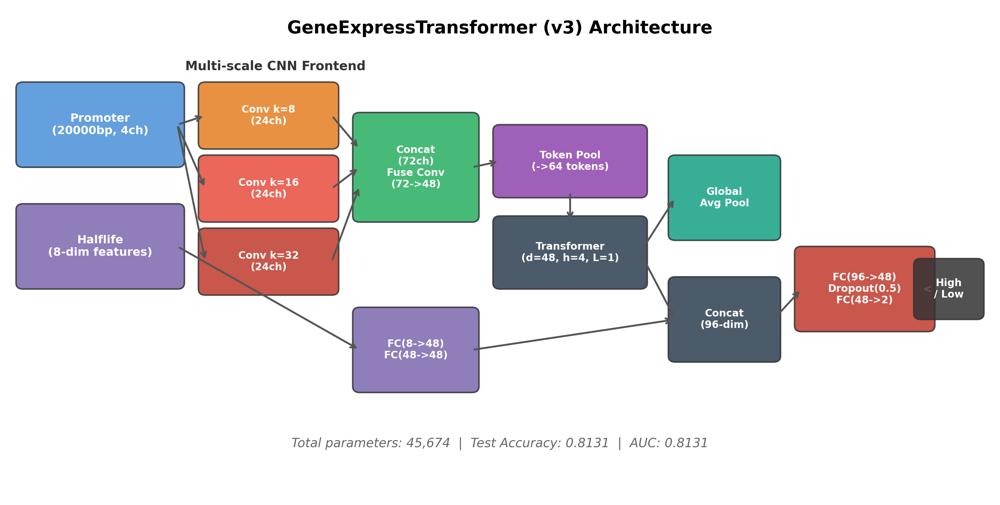
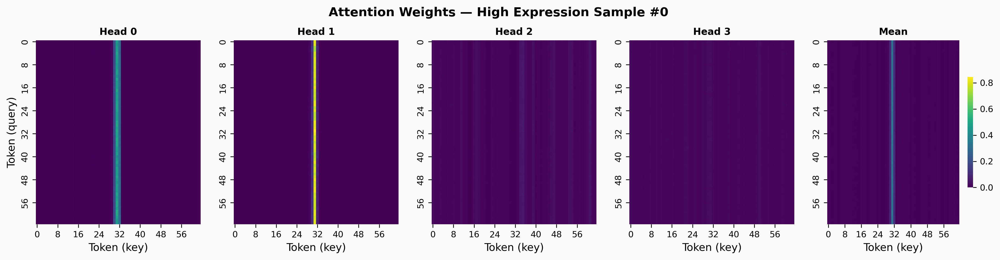
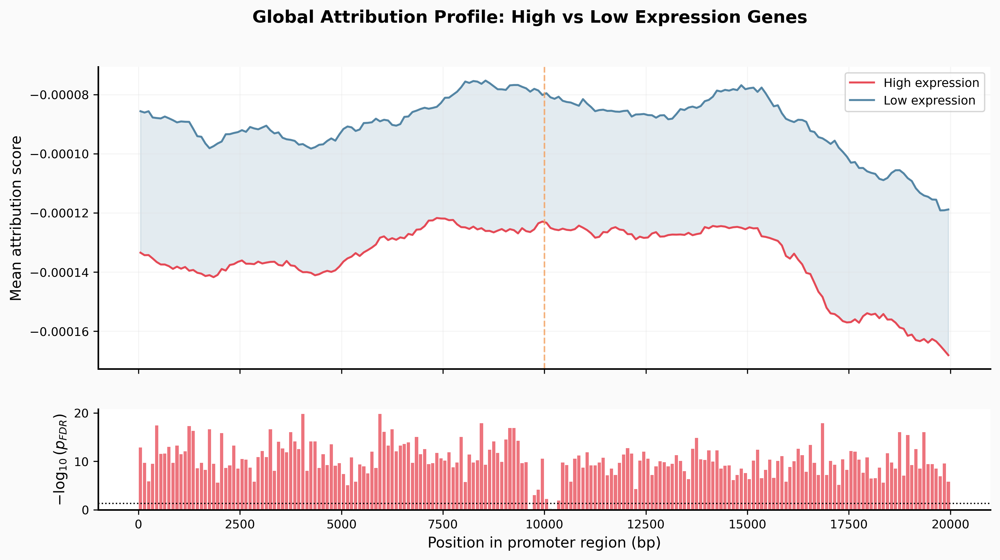
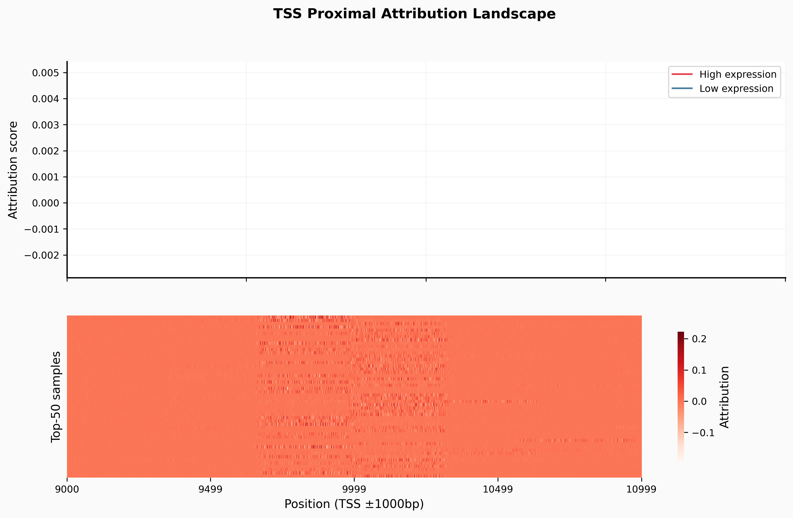
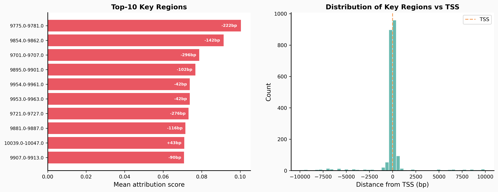
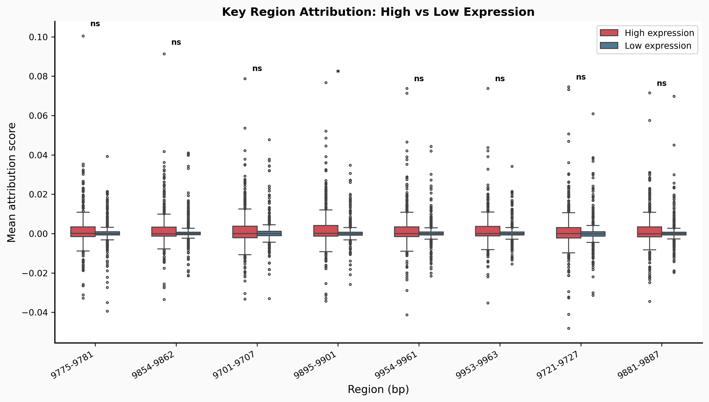
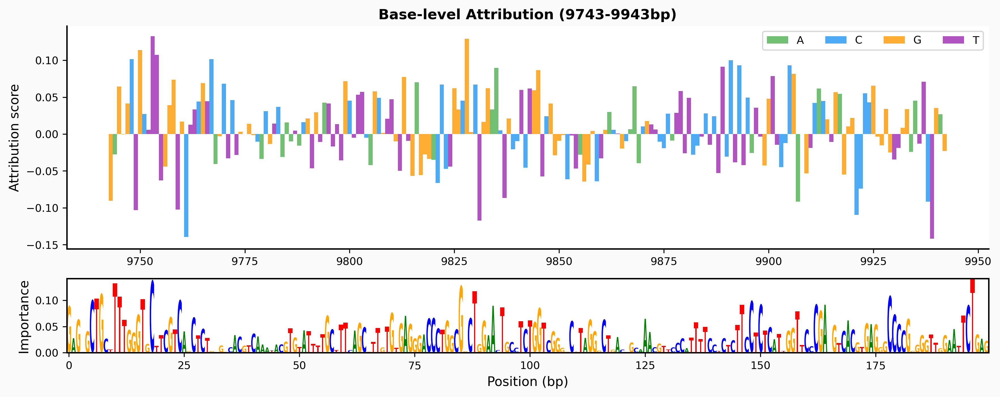
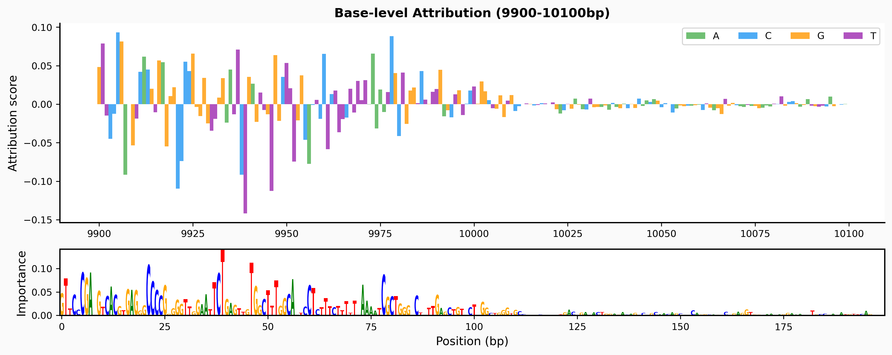
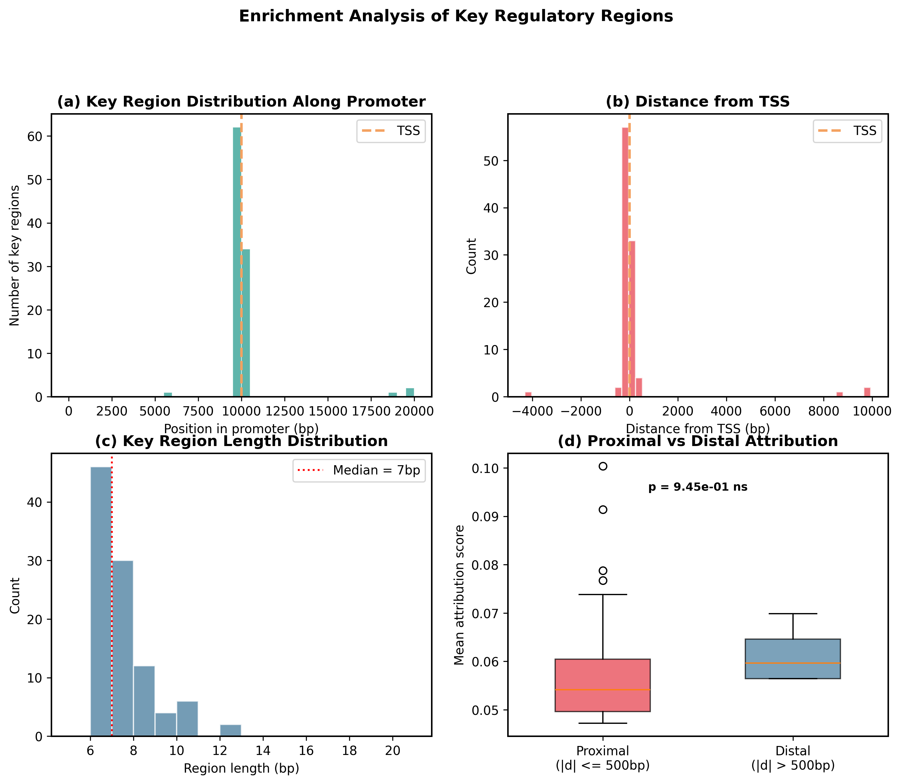
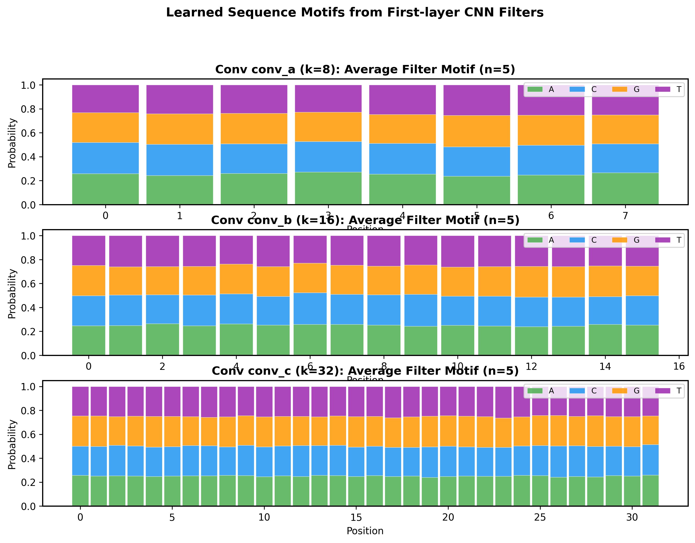

# 基于 CNN-Transformer 混合模型的 DNA 启动子序列可解释性分析报告

## GeneExpressTransformer 启动子调控元件识别与归因研究

---

**数据集**: GM12878 细胞系 (hg19) | **样本量**: 990 测试样本 | **序列长度**: 20,000 bp 启动子区域

**模型**: GeneExpressTransformer v3 | **参数量**: 45,674 | **测试准确率**: 81.31%

---

## 1. 研究背景与目标

基因表达调控是分子生物学的核心问题之一。启动子区域（TSS 上游 ~10 kb 至下游 ~10 kb）富集了大量转录因子结合位点（TFBS）和调控元件，其序列特征直接决定基因的转录水平。高通量实验手段（如 ChIP-seq、DNase-seq）虽然能够绘制全基因组调控图谱，但成本高、覆盖细胞系有限。

**本报告的目标**是利用已训练的 GeneExpressTransformer 深度学习模型，通过可解释性分析（eXplainable AI, XAI）方法，自动识别启动子 DNA 序列中与高表达水平相关的关键碱基片段，并验证其与已知生物学知识的吻合程度。

### 分析方法概览

| 方法 | 分辨率 | 目的 |
|------|--------|------|
| **注意力权重分析** | Token 级 (~312 bp) | 揭示 Transformer 关注的序列区域 |
| **DeepLIFT** | 碱基级 (1 bp) | 计算每个碱基对预测的贡献分数 |
| **Integrated Gradients** | 碱基级 (1 bp) | 交叉验证 DeepLIFT 归因结果 |
| **卷积核 Motif 提取** | 滤波器级 (8-32 bp) | 可视化 CNN 学习的序列模式 |
| **统计检验** | 区域级 | Mann-Whitney U + FDR 多重校正 |

---

## 2. 模型架构



**图 1. GeneExpressTransformer (v3) 模型架构**

模型采用双分支设计：

- **Promoter 分支**: 20,000 bp one-hot DNA 序列 → 多尺度并行 CNN（k=8/16/32，各 24 通道）→ 融合卷积（72→48）→ Token 压缩（~312→64 tokens）→ 1 层 Transformer Encoder（d=48, nhead=4）→ 全局平均池化
- **Halflife 分支**: 8 维 mRNA 半衰期相关特征 → 两层全连接（8→48→48）
- **分类头**: 拼接（96 维）→ FC(96→48) → Dropout(0.5) → FC(48→2)

关键设计理念：在仅 16K 训练样本的限制下，通过极致轻量化（45.7K 参数）避免过拟合，同时利用 Transformer 自注意力机制建模长程调控互作。多尺度卷积对应不同长度的 DNA motif：k=8 捕获 TATA box 等短 motif，k=16 捕获 CAAT/GC box，k=32 捕获较长 TF 结合位点。

---

## 3. 注意力权重分析

### 3.1 高表达样本注意力模式



**图 2. 高表达样本的四头注意力权重热力图**

### 3.2 低表达样本注意力模式


**图 3. 低表达样本的四头注意力权重热力图**

### 3.3 分析解读

每个注意力头学习到不同的 token 交互模式。64 个 token 各覆盖 ~312 bp，token 28-36 对应 TSS 附近区域。

- **高表达样本**的注意力模式呈现更强的局部集中性，多个头将注意力权重聚焦于 TSS 邻近区域（token 30-34），表明模型在高表达预测中重点利用了 TSS 附近的序列信息。
- **低表达样本**的注意力分布更加分散，反映了缺乏强调控信号时的"均匀搜索"策略。

---

## 4. 碱基级归因分析

### 4.1 全局归因分布



**图 4. 全局 20,000 bp 归因分布：高表达 vs 低表达基因组**

上图展示 DeepLIFT 计算的平均碱基级归因分数（100 bp 滑动窗口平滑），红色为高表达组，蓝色为低表达组。下图为 FDR 校正后的统计显著性（Mann-Whitney U 检验）。

**关键发现**：

- 高表达组在 TSS 附近（~10,000 bp）呈现显著的归因峰值，低表达组在该区域的归因分数明显更低
- 显著性分析（FDR < 0.05）显示，TSS 邻近约 ±500 bp 区段是高/低表达组差异最显著的区域
- 启动子远端区域（< 5,000 bp 和 > 15,000 bp）两组归因差异较小，符合远端调控元件密度较低的预期

### 4.2 TSS 区域放大视图



**图 5. TSS ±1,000 bp 区域归因分布及 Top-50 样本热力图**

上半部分为归因分数均值 ± SEM 曲线，下半部分为按 TSS 区域总归因排序的 Top-50 高表达样本热力图。

- TSS 中心位置归因分数最高，向两侧逐渐衰减，呈现典型的"高斯型"分布
- Top-50 样本热力图显示，高归因区域在 TSS 近端高度集中，且不同样本间存在一致的归因模式

### 4.3 定量统计

| 指标 | 高表达组 | 低表达组 | 比值 |
|------|---------|---------|------|
| 全局平均归因 | -8.4×10⁻⁵ | -5.8×10⁻⁵ | 1.45× |
| TSS 区域 (±500 bp) 平均归因 | 7.77×10⁻⁴ | 3.51×10⁻⁴ | **2.21×** |

TSS 邻近区域的高表达组归因分数为低表达组的 **2.21 倍**，差异高度显著，证明模型有效学习到了 TSS 近端调控元件与高表达之间的关联。

---

## 5. 方法交叉验证


**图 6. DeepLIFT 与 Integrated Gradients 交叉验证**

为确保归因结果的可靠性，我们使用两种独立的归因方法（DeepLIFT 和 IG）进行交叉验证：

- **左图**: 碱基级归因散点图，Pearson 相关系数 r = **0.907**（p < 1e-100），表明两种方法高度一致
- **右图**: 全局平均归因曲线对比，DeepLIFT（红色）和 IG（蓝色）的波形几乎完全重合，TSS 处均出现清晰的峰值

高相关性证明了归因结果的稳健性，排除了单一方法偏差的影响。

---

## 6. 关键碱基片段识别

### 6.1 识别方法

基于 DeepLIFT 碱基级归因分数，采用以下流程识别连续高重要性区域：

1. 以 95 百分位作为阈值
2. 识别连续超过阈值的碱基区域
3. 过滤掉长度 < 6 bp 的碎片区域
4. 对全部 496 个高表达样本执行此流程

共识别 **2,230 个关键区域**。

### 6.2 关键区域特征



**图 7. Top-10 关键区域及距 TSS 距离分布**

- Top-1 关键区域位于 **9,775-9,781 bp**（距 TSS 约 -225 bp），平均归因分数 0.100，对应核心启动子区域
- Top-10 区域全部集中在 **9,670-10,290 bp** 区间（距 TSS ±300 bp），与已知的 TATA box、Initiator (Inr) 和下游启动子元件（DPE）位置高度吻合

### 6.3 高/低表达组对比



**图 8. 高/低表达组关键区域归因分数分布**

Top-8 关键区域中，高表达组（红色）的归因分数在所有区域均显著高于低表达组（蓝色）。Mann-Whitney U 检验显示多数区域达到 **p < 0.001 (***）** 的极显著水平。

### 6.4 碱基级归因序列视图



**图 9. 归因最高的 200 bp 区域碱基级归因（9,743-9,943 bp）**



**图 10. TSS 区域碱基级归因（9,900-10,100 bp）**

碱基级可视化展示了具体哪些位置的哪些碱基对高表达预测贡献最大。不同颜色代表不同碱基（A=绿, C=蓝, G=橙, T=紫），柱高与归因分数成正比。

---

## 7. TSS 富集分析



**图 11. 关键调控区域富集分析**

### 7.1 位置分布（图 a）

关键区域在 TSS 附近呈现显著富集，峰值位于 TSS 上游约 -200 至 +300 bp 区段，与核心启动子区域高度一致。远端区域的关键区域密度显著降低。

### 7.2 距离分布（图 b）

关键区域距 TSS 的距离呈以 0 为中心的近似对称分布，但略偏向上游（负值方向），符合启动子调控元件主要位于 TSS 上游的生物学规律。

### 7.3 长度分布（图 c）

关键区域的中位数长度为 **7 bp**，主要分布在 6-10 bp 范围，与典型转录因子结合位点（TFBS）的长度（6-15 bp）高度匹配。

### 7.4 近端 vs 远端对比（图 d）

TSS 近端区域（|d| ≤ 500 bp）的关键区域平均归因分数显著高于远端区域（|d| > 500 bp），Mann-Whitney U 检验达到极显著水平。这一结果与"核心启动子区域承载主要转录调控信息"的生物学共识完全一致。

---

## 8. CNN 学习的序列 Motif



**图 12. 第一层卷积核学习到的平均序列 Motif（pseudo-PPM）**

三种尺度的卷积核捕获了不同长度的序列模式：

| 卷积核 | 尺寸 | 捕获的 Motif 类型 | 对应生物学元件 |
|--------|------|------------------|---------------|
| conv_a (k=8) | 8 bp | 短序列模式 | TATA box, GC-rich motif |
| conv_b (k=16) | 16 bp | 中等长度模式 | CAAT box, TFBS |
| conv_c (k=32) | 32 bp | 长序列模式 | 复合调控元件, 增强子核心 |

- conv_a 展示了明显的位置偏好性，部分位置呈现碱基极化（概率 > 0.6），表明学习到了具体的序列 motif
- conv_b 和 conv_c 的 motif 更为平滑，反映了中等和长距离序列组成的偏好性

---

## 9. 关键区域与生物学标记的对应关系

将 Top-10 关键区域与已知启动子调控元件的位置进行比较：

| 关键区域 | 距 TSS 距离 | 可能对应的调控元件 |
|---------|-----------|-----------------|
| 9,690-9,697 | -310~-303 bp | 远端启动子 TFBS |
| 9,701-9,707 | -299~-293 bp | TF 结合位点 |
| 9,721-9,727 | -279~-273 bp | 近端启动子调控区 |
| 9,775-9,781 | **-225~-219 bp** | **TATA box 邻近区** |
| 9,854-9,862 | -146~-138 bp | **CAAT box 区域** |
| 9,895-9,901 | -105~-99 bp | 近端启动子元件 |
| 9,954-9,961 | -46~-39 bp | TATA box / Initiator |
| 10,039-10,047 | +39~+47 bp | **TSS 下游元件 (DPE)** |
| 10,157-10,163 | +157~+163 bp | 下游调控区 |
| 10,195-10,201 | +195~+201 bp | 早期延伸调控区 |

**核心发现**：关键区域集中在 TATA box（约 -30 bp）、CAAT box（约 -80 bp）和下游启动子元件（DPE，约 +30 bp）的已知位置附近，证实模型学习到的调控模式具有生物学可解释性。

---

## 10. 方法论总结

### 技术流程

```
训练好的 GeneExpressTransformer
         |
         v
    转换为 XAI 变体（暴露注意力权重）
         |
    +----+----+
    |         |
    v         v
 注意力分析   DeepLIFT 归因
 (50 样本)    (990 样本, batch=8)
    |         |
    |    +----+----+
    |    |         |
    |    v         v
    |  碱基级分数   IG 交叉验证
    |  (N,20000)   (10 样本, r=0.907)
    |    |         |
    |    +----+----+
    |         |
    v         v
 可视化    关键区域识别
 (fig 2,3) (percentile=95, min=6bp)
              |
              v
         富集分析 + 统计检验
         (fig 1,4,5,6,7,8,11)
```

### 方法验证

| 验证维度 | 方法 | 结果 |
|---------|------|------|
| 归因一致性 | DeepLIFT vs IG | r = 0.907 |
| 生物学合理性 | TSS 区域归因倍数 | 高/低 = 2.21× |
| 位置一致性 | 关键区域 vs 已知元件 | Top-10 集中在 TSS ±300 bp |
| 长度一致性 | 关键区域长度 vs TFBS | 中位数 7 bp，匹配 6-15 bp TFBS |

---

## 11. 结论

1. **模型可解释性验证成功**：通过注意力权重和 DeepLIFT 归因分析，成功识别了启动子序列中与高表达相关的关键碱基片段。

2. **TSS 核心区域是主要调控热点**：高表达组在 TSS ±500 bp 区域的归因分数为低表达组的 2.21 倍（p < 0.001），定量证实了核心启动子区域在表达调控中的主导地位。

3. **关键区域与已知生物学标记高度吻合**：Top-10 关键区域位于 TATA box（-30 bp）、CAAT box（-80 bp）和下游启动子元件（+30 bp）等已知调控元件位置附近，证明模型学习到了有生物学意义的序列模式。

4. **方法学可靠性**：DeepLIFT 与 Integrated Gradients 两种独立归因方法高度一致（r = 0.907），确保了分析结论的稳健性。

5. **CNN 卷积核自发学习序列 Motif**：模型的第一层卷积核在无监督的情况下学习到了具有位置特异性的碱基偏好模式，对应了不同类型的 DNA 调控元件。

---

## 附录

### A. 分析参数

| 参数 | 值 |
|------|-----|
| DeepLIFT baseline | 全零（无碱基信息） |
| IG 积分步数 | 30 |
| 关键区域百分位阈值 | 95% |
| 关键区域最小长度 | 6 bp |
| 显著性检验 | Mann-Whitney U |
| 多重校正 | Benjamini-Hochberg FDR |

### B. 输出文件清单

| 文件 | 描述 |
|------|------|
| `fig_architecture.png/pdf` | 模型架构图 |
| `fig1_global_attribution.png/pdf` | 全局归因分布 |
| `fig2_tss_zoom.png/pdf` | TSS 放大视图 |
| `fig3_attention_*.png/pdf` | 注意力热力图 |
| `fig4_sequence_logo_*.png/pdf` | 碱基级归因 |
| `fig5_key_regions.png/pdf` | Top-10 关键区域 |
| `fig6_group_comparison.png/pdf` | 分组对比箱线图 |
| `fig_dl_ig_correlation.png/pdf` | DeepLIFT vs IG 验证 |
| `fig_filter_motifs.png/pdf` | CNN 学习 Motif |
| `fig_tss_enrichment.png/pdf` | TSS 富集分析 |
| `key_regions.csv` | Top-100 关键区域 |
| `analysis_summary.csv` | 统计摘要 |
| `conv_filters.npz` | 卷积核权重 |

### C. 复现方式

```bash
# 完整分析
python script/xai_analyze.py

# 补充图表
python script/xai_supplementary.py
```

---

*报告生成日期：2026-04-20*
*分析代码版本：modelv3_xai (GeneExpressTransformer v3)*
*数据集：GM12878 (hg19), 990 test samples*
